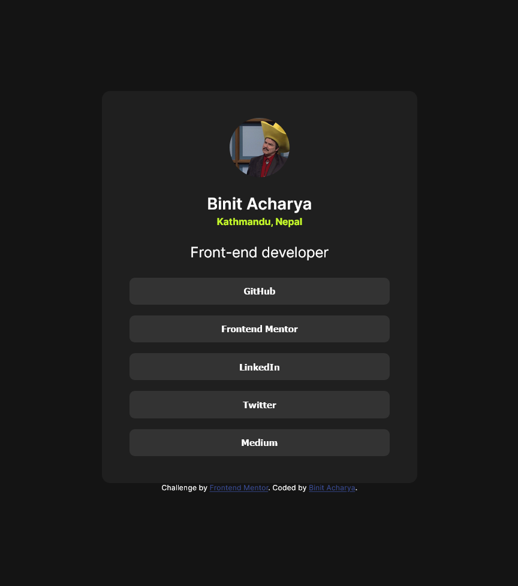

# Frontend Mentor - Social links profile solution

This is a solution to the [Social links profile challenge on Frontend Mentor](https://www.frontendmentor.io/challenges/social-links-profile-UG32l9m6dQ). Frontend Mentor challenges help you improve your coding skills by building realistic projects. 

## Table of contents

- [Overview](#overview)
  - [The challenge](#the-challenge)
  - [Screenshot](#screenshot)
  - [Links](#links)
- [My process](#my-process)
  - [Built with](#built-with)
  - [What I learned](#what-i-learned)
  - [Continued development](#continued-development)
  - [Useful resources](#useful-resources)
- [Author](#author)
- [Acknowledgments](#acknowledgments)

## Overview

### The challenge

Users should be able to:

- See hover and focus states for all interactive elements on the page

### Screenshot




### Links

- Solution URL: [Github Repository](https://github.com/BinitAcharya7/Social-Links-Profile)
- Live Site URL: [Live site URL](https://social-links-profileee.netlify.app/)

## My process

### Built with

- HTML5
- CSS custom properties
- Flexbox

### What I learned

- How to work with Flexbox.
- Making webpages responsive without using media queries, using the clamp function.
- Nesting flexboxes after looking at various spacings of elements.
- 

```css
.card {
  display: flex;
  padding: clamp(1.5rem, 8vw, 2.5rem);
  width: clamp(14rem, 80vw, 24rem);
}
```

### Continued development

- Must learn how to plan out in advance what I must do by looking at the required design.
- Must learn more responsive design concepts.
- Must use Figma dev tools better.


### Useful resources

- [An Interactive Guide to Flexbox](https://www.joshwcomeau.com/css/interactive-guide-to-flexbox/) - Great guide to learn the fundamentals and mental model of Flexbox.
- [rems vs ems](https://youtu.be/pautqDqa54I?si=XDMoABFZNhmjxvW9) - Video providing very clear ways to decide on when to use ems vs rems.
- [Top 10 Advanced Responsivene Design Concepts](https://youtu.be/TUD1AWZVgQ8?si=WgnhbYVucoUiWOwI) - Video explaining ways to make webpages responsive with and without media queries.


## Author

- Website - [Binit Acharya](https://binitacharya.medium.com/)
- Frontend Mentor - [@BinitAcharya7](https://www.frontendmentor.io/profile/BinitAcharya7)
- Twitter - [@Binit_Acharya](https://www.twitter.com/Binit_Acharya)

## Acknowledgments

Thanks Josh Comeau for actually explaining Flexbox. The properties all make sense now. 

